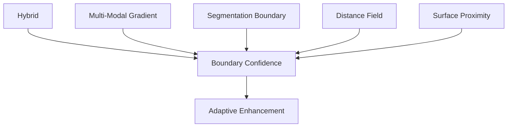

# 02.10 Evaluation Framework
02.10.1 Evaluation Philosophy

The HybridBrainViz framework is a visualization system, rather than a segmentation model. Consequently, the evaluation focuses on the effectiveness of the proposed visualization techniques rather than treating segmentation accuracy as the primary experimental outcome.

The evaluation is designed around the central research contribution:

segmentation-aware boundary enhancement within a hybrid multi-modal visualization combining direct volume rendering and surface-based rendering.

The evaluation therefore compares progressively richer visualization configurations rather than comparing different segmentation algorithms.

The core experimental progression is:

02.10.4 The Evaluation We Actually Need

I recommend four evaluation dimensions:

flowchart TD
    E["02.10 Evaluation"]

    B["1. Boundary Field Evaluation"]
    V["2. View Consistency Evaluation"]
    X["3. Expert Evaluation"]
    R["4. Rendering Performance Evaluation"]

    E --> B
    E --> V
    E --> X
    E --> R

02.10.5 Evaluation Matrix

| Evaluation | Main Question | Baseline | Why Needed |
|---|---|---|---|
| Boundary Field Evaluation | Does boundary enhancement actually improve boundary visibility? | DVR / Hybrid without enhancement | **Primary contribution** |
| View Consistency Evaluation | Does the improvement persist as the 3D object is rotated? | Same baselines | **Addresses 3D visualization concern** |
| Expert Evaluation | Do users/clinicians perceive the improvement and understand the anatomy better? | Controlled visualization modes | **Clinical/perceptual validation** |
| Rendering Performance | Is the method computationally practical? | Hybrid without enhancement / relevant implementation baseline | **Technical feasibility** |

02.10.6 Baseline Strategy

This is one of the most important methodological decisions.

We do have a baseline.

The primary baseline should be:

B1 — Hybrid Visualization Without Boundary Enhancement

versus:

P1 — Proposed Hybrid Visualization

flowchart TD
    MRI["MRI"]
    SEG["Segmentation"]
    RENDER["Surface + DVR"]
    BF["Boundary Field"]
    BC["Boundary Confidence"]
    AE["Adaptive Enhancement"]
    OUT["Proposed Hybrid Visualization"]

    MRI --> RENDER
    SEG --> RENDER

    RENDER --> BF
    BF --> BC
    BC --> AE
    AE --> OUT

This is the cleanest comparison because everything remains constant except your contribution.

Secondary baselines

We can also include:

B2 — DVR Only

flowchart TD
    MRI["MRI"]
    DVR["DVR"]

    MRI --> DVR

B3 — Surface Only

flowchart TD
    SEG["Segmentation"]
    MC["Marching Cubes"]
    SR["Surface Rendering"]

    SEG --> MC
    MC --> SR

B4 — Hybrid Without Boundary Enhancement

DVR + Surface

B5 — Proposed

Therefore: 

flowchart TD
    DVR["DVR"]
    SURFACE["Surface"]
    BE["Boundary Enhancement"]
    OUT["Enhanced Hybrid Visualization"]

    DVR --> OUT
    SURFACE --> OUT
    BE --> OUT

    flowchart LR
    B2["B2"] --> B3["B3"] --> B4["B4"] --> B5["B5"]

provides a very useful ablation progression.

But B4 → B5 is the most important comparison.

# 02.10.7 Evaluation 1 — 3D Boundary Field Evaluation

This is the primary evaluation.

It directly evaluates your contribution.

Your system generates a boundary confidence field

$$
C_B(x,y,z)
$$

where higher values indicate stronger boundary enhancement.

The question becomes:

Does the proposed method concentrate visual enhancement around the actual tumor boundary while avoiding unnecessary enhancement elsewhere?

# 02.10.7.1 Boundary Region

From the segmentation mask S, extract a 3D boundary:

$$
B = \partial S
$$

Then construct a narrow 3D boundary band:

$$
R_B = \{x \mid d(x,B) \leq r\}
$$

where:

d(x,B) = distance from voxel x to the boundary,
r = boundary-band radius.

For example:

                 Tumor
        ┌───────────────────┐
       /                     \
      /       Interior       \
     |                       |
     |      ┌───────────┐    |
     |      │  Boundary │    |
     |      └───────────┘    |
      \                     /
       \___________________/
In implementation we will use the actual 3D voxel geometry rather than this conceptual representation.

# 02.10.7.2 Boundary Enhancement Strength

Calculate the mean enhancement within the boundary region:

$$
E_B = (1 / |R_B|) \sum_{x \in R_B} C_B(x)
$$

This tells us:

How strongly does the algorithm enhance the actual tumor boundary?

# 02.10.7.3 Non-Boundary Enhancement

Define a region away from the boundary:

$$
R_N
$$

Then:

$$
E_N = (1 / |R_N|) \sum_{x \in R_N} C_B(x)
$$

This tells us whether the algorithm is unnecessarily enhancing non-boundary regions.

02.10.7.4 Boundary-to-Nonboundary Enhancement Ratio

This becomes one of our principal metrics:

$$
BER = E_B / (E_N + \epsilon)
$$

where ϵ prevents division by zero.

Higher:

BER

means the enhancement is more specifically concentrated around the boundary.

Interpretation

flowchart TD
    BER1["BER ≈ 1"]
    LOW["Little Boundary Specificity"]

    BERH["BER >> 1"]
    HIGH["Strong Boundary Specificity"]

    BER1 --> LOW
    BERH --> HIGH

I would call this a Boundary Enhancement Ratio and explicitly describe it as a proposed study-specific metric, rather than presenting it as an established universal standard.

# 02.10.7.5 3D Boundary Contrast

We can also measure the contrast between the boundary region and neighboring tissue.

For the rendered/enhanced representation:

$$
CNR_{3D} = | \mu_B - \mu_N | / sqrt(\sigma_B^2 + \sigma_N^2)
$$

where:

- $$ \mu_B $$ = mean boundary response,
- $$ \mu_N $$ = mean neighboring-region response,
- $$ \sigma_B,\ \sigma_N $$ = corresponding standard deviations.

The important thing is that these regions are defined in 3D space, not selected from a screenshot.

This directly addresses your previous reviewer's concern.

# 02.10.7.6 Boundary Field Evaluation Comparison

For every case:

| Configuration | $E_B$ | $E_N$ | $BER$ | $CNR_{3D}$ |
|---|---:|---:|---:|---:|
| DVR Only | — | — | — | — |
| Hybrid | — | — | — | — |
| Hybrid + Boundary Enhancement | — | — | **—** | **—** |

The central hypothesis is:

$$
BER_{Proposed} > BER_{Hybrid}
$$

and preferably:

$$
CNR_{3D,Proposed} > CNR_{3D,Hybrid}
$$

These express the expected outcome that the proposed boundary-enhanced hybrid method should achieve greater boundary specificity and stronger 3D boundary contrast than the standard hybrid baseline.This is directly connected to your research contribution. 

# 02.10.8 Evaluation 2 — View Consistency Evaluation

I strongly agree with retaining this.

It is particularly important because your previous evaluation was criticized for relying on manually selected 2D screenshots.

The uploaded paper provides a useful methodological precedent: its performance testing uses a predefined camera motion path and records the first 100 frames under controlled rendering conditions.

We should adapt this idea specifically to visualization quality.

Instead of:

flowchart TD
    R["Rotate Manually"]
    A["Choose Optimal Viewing Angle"]
    S["Capture Screenshot"]

    R --> A
    A --> S

we implement:

flowchart TD
    A["0°"]
    B["30°"]
    C["60°"]
    D["90°"]
    E["180°"]
    F["270°"]
    G["300°"]
    H["330°"]
    T["TUMOR"]

    A --- T
    B --- T
    C --- T
    D --- T
    E --- T
    F --- T
    G --- T
    H --- T

For example:

with controlled elevation and distance.

The same trajectory is applied to:

$$
\theta \in \{0^\circ, 30^\circ, 60^\circ, \ldots, 330^\circ\}
$$

- DVR,
- Hybrid,
- Proposed Hybrid + Boundary Enhancement.

02.10.8.2 Per-View Boundary Score

For each view v:

$$
Q_v = BER_v
$$

or alternatively use the 3D-derived boundary score projected into the view.

Then:

$$
\bar{Q} = (1 / N) \sum_{v=1}^{N} Q_v
$$

gives the mean boundary visibility/enhancement across views.

Where:

- $Q_v$ is the boundary enhancement score at viewing angle $v$.
- $BER_v$ is the Boundary Enhancement Ratio measured at viewing angle $v$.
- $\bar{Q}$ is the mean view-consistency score across all views.
- $N$ is the total number of evaluated viewing angles.

# 02.10.8.3 View Consistency

We can calculate the standard deviation:

$$
\sigma_Q = sqrt((1 / N) \sum_{v=1}^{N} (Q_v - \bar{Q})^2)
$$

Lower:

$$
\sigma_Q
$$

means more consistent performance across viewpoints.

We can also report the coefficient of variation:

$$
CV = \sigma_Q / \bar{Q}
$$

This gives us a normalized measure of view-to-view instability.

# 02.10.8.4 Why This Matters

The central claim becomes:

The proposed boundary-enhancement method improves boundary visibility consistently across 3D viewpoints, rather than only from a favorable manually selected view.

That is exactly the criticism we want to eliminate.

# 02.10.9 Evaluation 3 — Expert Evaluation

I agree completely that this should remain.

The reference paper itself uses expert evaluation with nine healthcare professionals and a 5-point Likert questionnaire addressing depth ordering, information revealed by volume rendering, clinical information, preoperative usefulness, information integration, and interpretation.

So we are not inventing an inappropriate methodology.

However, our questionnaire should be adapted to our research question.

# 02.10.9.3 Expert Evaluation Statistics

For each question:

$$
\bar{X} = (1 / n) \sum_{i=1}^{n} x_i
$$

and report:

mean,
median,
standard deviation,
response distribution.

Because Likert data are ordinal, the median and distribution should not be hidden behind the mean alone.

For agreement:

$$
Agreement = ((N_4 + N_5) / N) \times 100
$$

Where:

$\bar{X}$ — mean expert rating.
$x_i$ — rating provided by expert $i$.
$n$ — number of expert ratings.
$N$ — total number of evaluated responses.
$N_4$ — number of responses rated 4 (Agree).
$N_5$ — number of responses rated 5 (Strongly Agree).

Thus, the agreement percentage represents the proportion of evaluators giving a positive rating of 4 or 5. If the study design supports it, we can additionally assess inter-rater agreement, but I would not make this another centerpiece of the thesis.

# 02.10.10 Evaluation 4 — Rendering Performance

This one should remain, but it is not a visualization-quality metric.

It answers:

Can the proposed visualization operate interactively?

The uploaded paper explicitly evaluates this using fixed resolution, 1024 sampling steps, a predefined camera path, 100 frames, mean frame time and standard deviation.

We can adopt the same philosophy.

Mean frame time

$$
T_{mean} = (1 / N) \sum_{i=1}^{N} T_i
$$

Frame-time variability

$$
\sigma_T = sqrt((1 / N) \sum_{i=1}^{N} (T_i - T_{mean})^2)
$$

Frames per second

$$
FPS = 1000 / T_{mean}
$$

Where:

$T_i$ — rendering time for frame $i$, measured in milliseconds.
$T_{mean}$ — mean rendering time across all evaluated frames.
$\sigma_T$ — standard deviation of rendering time.
$N$ — total number of evaluated frames.
$FPS$ — estimated rendering throughput in frames per second.

Note: The FPS equation assumes $T_{mean}$ is measured in milliseconds per frame.

Approximately:

when is expressed in milliseconds.

Why keep this?

Because boundary enhancement introduces additional computation:

flowchart TD
    DVR["DVR"]
    SURFACE["Surface"]
    GRAD["Gradient"]
    BOUND["Boundary"]
    DIST["Distance Field"]
    AE["Adaptive Enhancement"]
    OUT["Boundary-Enhanced Hybrid Visualization"]

    DVR --> OUT
    SURFACE --> OUT
    GRAD --> OUT
    BOUND --> OUT
    DIST --> OUT
    AE --> OUT

A reviewer can reasonably ask:

"What computational cost does your proposed boundary enhancement introduce?"

Therefore we should compare:

| Configuration | Frame Time (ms) | FPS |
|---|---:|---:|
| DVR | — | — |
| Hybrid | — | — |
| Proposed Hybrid + Boundary | — | — |

The reference paper also reports frame-time standard deviation as an indicator of temporal stability.

# 02.10.11 Final Evaluation Architecture

Therefore, I recommend that 02.10 contain only this:

02.10 Evaluation Framework
│
├── 02.10.1 Evaluation Philosophy
│
├── 02.10.2 Experimental Conditions & Baselines
│
├── 02.10.3 Boundary Field Evaluation
│   ├── Boundary Enhancement Strength
│   ├── Non-Boundary Enhancement
│   ├── Boundary Enhancement Ratio
│   └── 3D Boundary CNR
│
├── 02.10.4 View Consistency Evaluation
│   ├── Controlled Camera Trajectory
│   ├── Mean View Score
│   ├── Standard Deviation
│   └── Coefficient of Variation
│
├── 02.10.5 Expert Evaluation
│   ├── Boundary Perception
│   ├── 3D Spatial Understanding
│   ├── Hybrid Information
│   ├── Boundary Enhancement
│   ├── Multi-Modal Integration
│   └── Clinical Usefulness
│
└── 02.10.6 Rendering Performance
    ├── Mean Frame Time
    ├── Frame-Time SD
    └── FPS

# 02.10.13 The Scientific Logic

Your evaluation now has a very clean chain:

flowchart TD
    RQ["RESEARCH QUESTION  Does boundary enhancement improve brain-tumor visualization?"]

    WORKS["Does it work?"]
    REMAIN["Does it remain consistent?"]
    HUMANS["Do humans perceive it?"]

    BF["Boundary Field Evaluation"]
    VC["View Consistency Evaluation"]
    EE["Expert Evaluation"]

    PV["Proposed Visualization"]

    PRACTICAL["Is it computationally practical?"]
    PE["Performance Evaluation"]

    RQ --> WORKS
    RQ --> REMAIN
    RQ --> HUMANS

    WORKS --> BF
    REMAIN --> VC
    HUMANS --> EE

    BF --> PV
    VC --> PV
    EE --> PV

    PV --> PRACTICAL
    PRACTICAL --> PE

That is a research evaluation framework, rather than a collection of metrics.

# 02.10.15 The Final Experimental Design

I would therefore make the actual experiment extremely disciplined:

flowchart TD
    MRI["SAME MRI CASE"]
    BEF["BEFUnet"]
    SEG["Segmentation Map"]

    DVR["DVR"]
    MC["Marching Cubes"]
    MESH["Mesh"]
    HYBRID["HYBRID"]

    NO_BE["No Boundary Enhancement"]
    BF["Boundary Field"]
    AE["Adaptive Enhancement"]
    PROPOSED["PROPOSED SYSTEM"]

    BOUNDARY["Boundary Evaluation"]
    VIEW["View Consistency"]
    EXPERT["Expert Evaluation"]
    PERF["Performance"]

    MRI --> BEF
    BEF --> SEG

    SEG --> DVR
    SEG --> MC
    MC --> MESH

    DVR --> HYBRID
    MESH --> HYBRID

    HYBRID --> NO_BE
    HYBRID --> BF
    BF --> AE

    NO_BE --> PROPOSED
    AE --> PROPOSED

    PROPOSED --> BOUNDARY
    PROPOSED --> VIEW
    PROPOSED --> EXPERT

    BOUNDARY --> PERF
    VIEW --> PERF
    EXPERT --> PERF

| Claim | Evaluation |
|---|---|
| Boundary enhancement increases boundary specificity | **Boundary Field Evaluation** |
| Enhancement is not dependent on one favorable view | **View Consistency** |
| Humans can actually perceive/benefit from it | **Expert Evaluation** |
| The additional processing remains practical | **Rendering Performance** |

This is, in my view, much stronger than the earlier oversized evaluation framework.

Most importantly, it aligns every metric with a specific claim:

That is the evaluation framework I would now lock into 02.10_Evaluation_Framework.md.

And I would make Boundary Field Evaluation + View Consistency the quantitative core of your thesis, with Expert Evaluation as the perceptual/clinical validation and Rendering Performance as the technical validation. This also stays closely aligned with the uploaded paper's actual methodology rather than pretending that the paper used a standardized 3D visualization metric that it did not use.