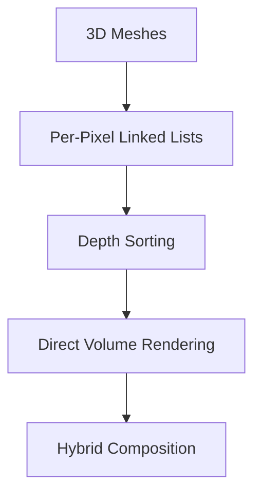
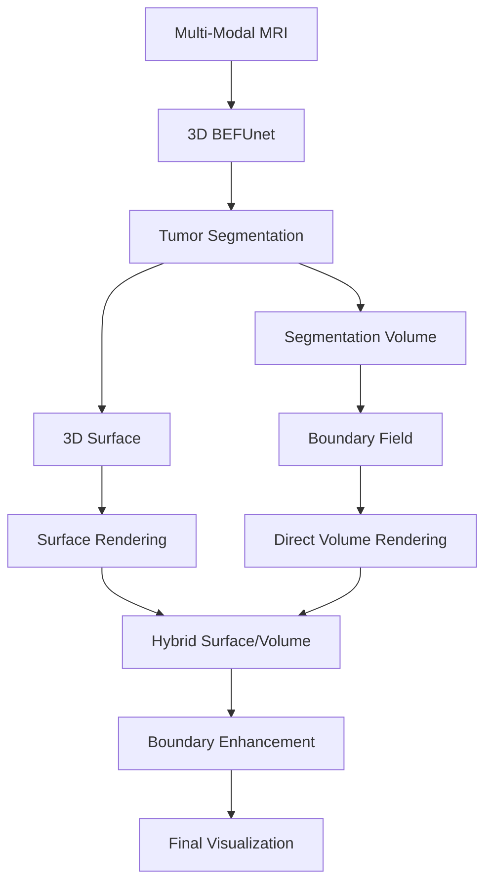
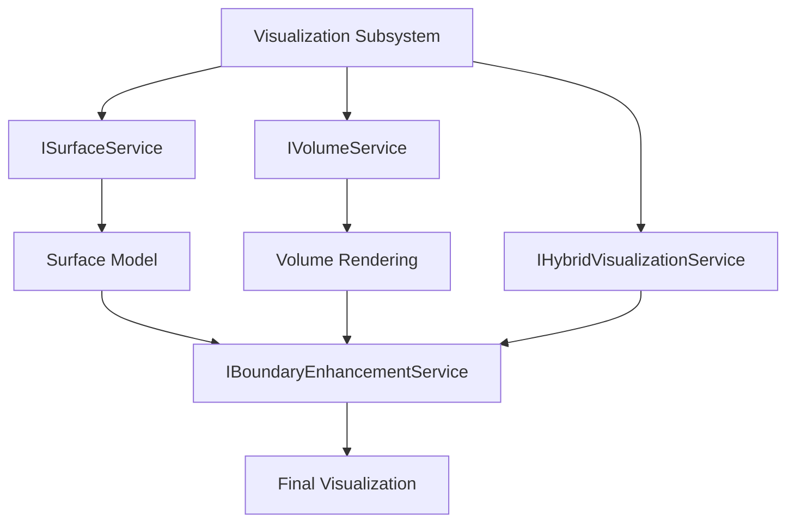
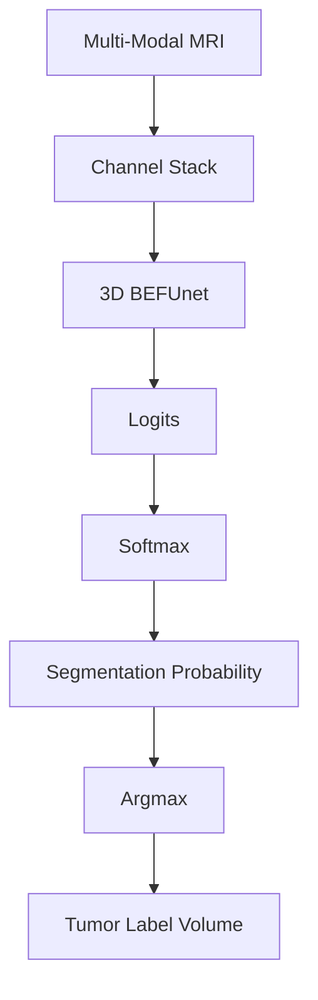
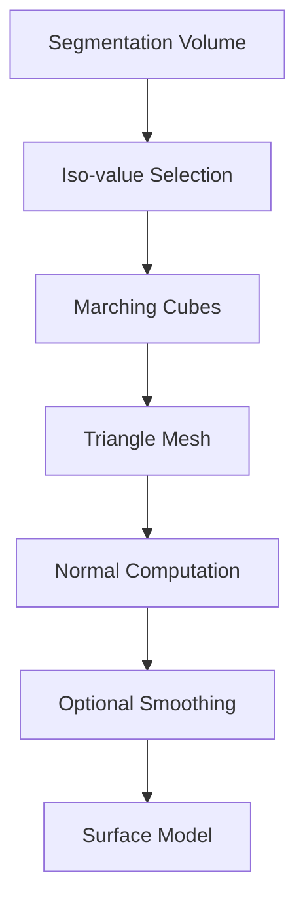
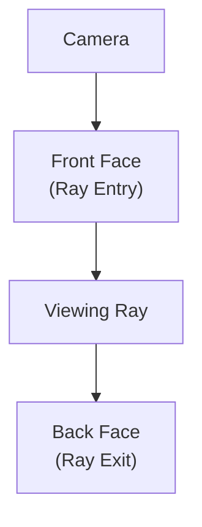
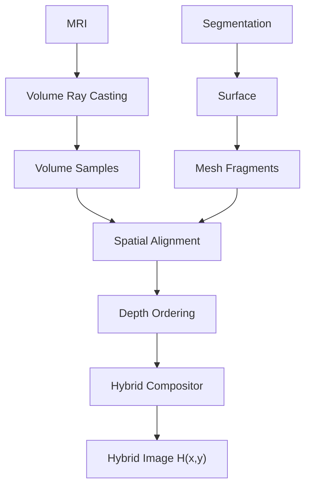

# HybridBrainViz Visualization Algorithms and Boundary-Enhanced Hybrid Rendering

Version: 1.0

Status:
Research Algorithm and Visualization Methodology Specification

Document:
02.9_Visualization_Algorithms_and_Boundary_Enhanced_Hybrid_Rendering.md

Project:
HybridBrainViz

Research Title:
Hybrid Visualization Framework for Multi-Modal Brain Tumor

Primary Research Contributions:

1. Multi-modal brain tumor hybrid visualization
2. Integration of surface and volumetric representations
3. Segmentation-aware boundary enhancement
4. Boundary-preserving hybrid compositing
5. Quantitative evaluation of visualization quality and performance

---

# Table of Contents

1. Purpose
2. Research Positioning
3. Relationship to the Reference Paper
4. Existing Implementation Foundation
5. Proposed Visualization Architecture
6. End-to-End Algorithm
7. Algorithm 1: Multi-Modal MRI Preparation
8. Algorithm 2: 3D BEFUnet Segmentation
9. Algorithm 3: 3D Tumor Boundary Extraction
10. Algorithm 4: Surface Generation
11. Algorithm 5: Direct Volume Rendering
12. Algorithm 6: Surface–Volume Hybrid Rendering
13. Algorithm 7: Segmentation-Aware Boundary Enhancement
14. Algorithm 8: Boundary-Enhanced Hybrid Composition
15. Multi-Modal Boundary Model
16. Boundary Confidence Model
17. Adaptive Boundary Enhancement
18. Render Graph Representation
19. Complete Processing Flow
20. GPU Processing Flow
21. Implementation Mapping
22. Baseline Methods
23. Ablation Study
24. Evaluation Framework
25. Expected Research Outputs
26. Limitations
27. Future Extensions

---

# 1. Purpose

This document defines the core visualization algorithms of HybridBrainViz.

The purpose is to transform multi-modal brain MRI and segmentation information
into a unified three-dimensional visualization that simultaneously exposes:

- volumetric anatomical information,
- segmented tumor structures,
- tumor surface geometry,
- internal tumor characteristics,
- tumor boundaries,
- spatial relationships between tumor compartments.

The architecture combines:

1. Multi-modal MRI volume rendering
2. AI-generated tumor segmentation
3. Surface extraction
4. Surface rendering
5. Direct Volume Rendering
6. Hybrid surface-volume compositing
7. Segmentation-aware boundary enhancement

The final objective is not merely to display a tumor in 3D.

The objective is to provide a visualization that makes the tumor boundary,
internal structure, and spatial relationship with surrounding tissue more
perceptually and quantitatively distinguishable.

---

# 2. Research Positioning

The proposed system is an adaptation and extension of existing hybrid medical
visualization concepts to multi-modal brain MRI.

The reference hybrid visualization work combines:

- 3D mesh rendering,
- Per-Pixel Linked List Order Independent Transparency,
- Direct Volume Rendering,
- spatial registration,
- alpha compositing.

The reference method stores mesh fragments in GPU head/node buffers, sorts
fragments by depth, and then blends them with volumetric medical-image samples.
The paper explicitly describes three principal rendering steps:

1. Store 3D mesh information in GPU buffers.
2. Sort mesh information by depth.
3. Blend mesh information with the medical-image volume using DVR.

The reference method therefore provides the foundation for the hybrid
surface-volume portion of HybridBrainViz.

HybridBrainViz extends this concept by introducing a segmentation-aware,
brain-tumor-specific boundary-enhancement mechanism.

---

# 3. Relationship to the Reference Paper

The reference methodology is divided conceptually into:

The proposed HybridBrainViz methodology becomes:

The major difference is therefore not that HybridBrainViz simply reproduces
the reference paper.

It uses the reference paper as the hybrid-rendering foundation while introducing
a segmentation-aware boundary representation specifically designed for brain
tumor visualization.

# 4.1 Surface Rendering Foundation

Repository:

3D-Brain-Tumor-Mesh-Viewer

Current capabilities include:

OBJ loading
mesh representation
vertex normal computation
OpenGL mesh rendering
camera interaction
transparency
multiple tumor compartments

Existing assets include:

whole tumor
whole tumor reference
tumor core
enhancing tumor

The existing viewer therefore provides the foundation for:

ISurfaceService

# 4.2 Volume Rendering Foundation

Repository:

BoundaryEnhancedDVR

Current capabilities include:

NIfTI loading
3D texture upload
proxy-cube rendering
back-face position rendering
front-to-back ray marching
T1ce sampling
FLAIR sampling
segmentation sampling
gradient computation
transfer-function logic
Phong illumination
boundary-dependent opacity/color enhancement
FPS measurement
CNR
SSIM
boundary metrics

The current renderer uses a cube as proxy geometry.

This is correct and should be retained.

The cube does not represent the tumor.

It defines the volume through which the GPU casts rays.

# 5. Proposed Visualization Architecture

The Visualization Subsystem is composed of four principal services.

# 6. End-to-End Algorithm

The complete algorithm is:
Algorithm: Boundary-Enhanced Hybrid Brain Tumor Visualization

Input:

T1
T1ce
T2
FLAIR

Output:

Boundary-enhanced 3D brain tumor visualization

Step 1

Load multi-modal MRI.

Step 2

Validate dimensions, spacing, orientation, and registration.

Step 3

Normalize modalities.

Step 4

Run 3D BEFUnet.

Step 5

Generate tumor segmentation.

Step 6

Generate tumor boundary representation.

Step 7

Extract tumor surface.

Step 8

Upload MRI and segmentation volumes to GPU.

Step 9

Generate volume-rendered representation.

Step 10

Render tumor surface.

Step 11

Generate hybrid surface-volume representation.

Step 12

Calculate segmentation-aware boundary strength.

Step 13

Apply adaptive boundary enhancement.

Step 14

Composite enhanced boundary information with hybrid rendering.

Step 15

Display final visualization.

# 7. Algorithm 1: Multi-Modal MRI Preparation

Input

Four MRI modalities:

T1

T1ce

T2

FLAIR

Output

Registered normalized volume set.

Procedure

FOR each modality:

    Load NIfTI

    Read:
        dimensions
        voxel spacing
        origin
        orientation
        affine

    Validate spatial metadata

    Normalize intensity

END FOR

Verify registration

Create MultiModalVolume

Mathematical representation

Let:

$$
\mathcal{M} = \{I_{T1}, I_{T1ce}, I_{T2}, I_{FLAIR}\}
$$

Each modality is represented as:

$$
I_m(x,y,z)
$$

where m represents the modality.

The normalized volume is:

I'_m(x, y, z) = (I_m(x, y, z) - I_min) / (I_max - I_min)

# 8. Algorithm 2: 3D BEFUnet Segmentation

The segmentation stage produces the anatomical label volume used by the
visualization subsystem.

For each voxel, the class probability is:

P(c | x, y, z) = Softmax(Lc)

The predicted class is:

ŷ(x, y, z) = arg max_c P(c | x, y, z)

The resulting segmentation volume is:

S(x, y, z) ∈ {0, 1, ..., C - 1}

For brain tumor visualization, the labels may represent:

- 0 = Background
- 1 = Necrotic / Non-enhancing tumor
- 2 = Edema
- 3 = Enhancing tumor

The exact mapping must follow the selected dataset convention.

# 9. Algorithm 3: 3D Tumor Boundary Extraction

Boundary extraction is a central component of the proposed framework.

The existing prototype contains a 2D boundary computation.

This is insufficient for the final 3D framework.

HybridBrainViz therefore defines a true 3D boundary operator.

For each voxel v, the binary boundary indicator is:

B(v) =
- 1, if any neighboring voxel belongs to a different class
- 0, otherwise
  
$$
B(v) =
\begin{cases}
1: & \text{if any neighboring voxel belongs to a different class} \ 
0: & \text{otherwise}
\end{cases}
$$

Using a 6-connected neighborhood:

$$
N_6(v) =
{v_{x}^+,v_{x}^-,v_{y}^+,v_{y}^-,v_{z}^+,v_{z}^-}
$$

The boundary strength is:

$$
B(v) =
\max_{u \in N_6(v)}
\left|S(v)-S(u)\right|
$$

A distance-based boundary field may then be constructed:

$$
D_B(v) =
\exp
\left(
-\frac{d(v,B)^2}{2\sigma_B^2}
\right)
$$

where:

- d(v, B) is the distance to the nearest boundary voxel
- σ_B controls the boundary thickness

This produces a continuous boundary influence field instead of a binary edge.

# 10. Algorithm 4: Surface Generation

The segmentation volume is converted into a polygonal representation.

For a binary tumor mask:
$$
S(x,y,z) \in \{0,1\}
$$
the iso-value is typically: 
$$
\tau = 0.5
$$

Marching Cubes evaluates each voxel cube and determines the intersected
triangles using the standard 256-case lookup structure.

The output is:
$$
M = (V,F,N)
$$
where:

V = vertices
F = triangle faces
N = normals

The mesh inherits the spatial geometry of the segmentation volume.

# 11. Algorithm 5: Direct Volume Rendering

The volume renderer uses proxy geometry.

flowchart TD MRI["MRI Volume"] CUBE["Proxy Cube"] MRI --> CUBE

The cube defines the spatial domain of the volume.

It does not represent anatomical geometry.

This is why the cube should remain in HybridBrainViz.

Ray Generation

For every screen pixel:

The current implementation stores the back-face texture coordinates and uses
the fragment's front-face texture coordinate as the ray entry point.

The ray is:

$$
r(t) = p_{entry} + td
$$
where:
$$
d = -\frac{p_{exit} - p_{entry}}{||p_{exit} - p_{entry}||}
$$

Sampling

The ray is divided into N equally spaced samples.

$$
p_i = p_{entry} + i\Delta s d
$$
At each sample:
-MRI density
- FLAIR
- Segmentation label
- Gradient
- Boundary strength
are evaluated.

Volume Gradient

The current implementation uses central differences.
For voxel spacing:
$$
h_x, h_y, h_z
$$

$$
G_x = (I(x+h_x,y,z) - I(x-h_x,y,z)) / (2h_x)
$$

$$
G_y = (I(x,y+h_y,z) - I(x,y-h_y,z)) / (2h_y)
$$

$$
G_z = (I(x,y,z+h_z) - I(x,y,z-h_z)) / (2h_z)
$$

The gradient magnitude is:

$$
G = \sqrt{G_x^2 + G_y^2 + G_z^2}
$$

The normalized gradient is then computed as:

$$
G_n = clamp(kG,0,1)
$$

The gradient magnitude is:

$$
G = \sqrt{G_x^2 + G_y^2 + G_z^2}
$$

The normalized gradient is then computed as:

$$
G_n = clamp(kG,0,1)
$$

# 12. Algorithm 6: Surface–Volume Hybrid Rendering

The hybrid renderer combines two complementary representations.

Surface

Provides:

- explicit tumor geometry
- anatomical boundary
- spatial orientation
- semantic structure
Volume

Provides:

- internal MRI information
- intensity variation
- subtle structures
- information missed by segmentation

The reference paper motivates this combination because segmented meshes can
miss clinically relevant information present in the original medical volume.

Hybrid Composition

The conceptual pipeline is:

