# HybridBrainViz Visualization Algorithms and Boundary-Enhanced Hybrid Rendering

Version: 1.0

Status:
Research Algorithm and Visualization Methodology Specification

Document:
02.9_Visualization_Algorithms_and_Boundary_Enhanced_Hybrid_Rendering.md

Project:
HybridBrainViz

Research Title:
Hybrid Visualization Framework for Multi-Modal Brain Tumor

Primary Research Contributions:

1. Multi-modal brain tumor hybrid visualization
2. Integration of surface and volumetric representations
3. Segmentation-aware boundary enhancement
4. Boundary-preserving hybrid compositing
5. Quantitative evaluation of visualization quality and performance

---

# Table of Contents

1. Purpose
2. Research Positioning
3. Relationship to the Reference Paper
4. Existing Implementation Foundation
5. Proposed Visualization Architecture
6. End-to-End Algorithm
7. Algorithm 1: Multi-Modal MRI Preparation
8. Algorithm 2: 3D BEFUnet Segmentation
9. Algorithm 3: 3D Tumor Boundary Extraction
10. Algorithm 4: Surface Generation
11. Algorithm 5: Direct Volume Rendering
12. Algorithm 6: Surface–Volume Hybrid Rendering
13. Algorithm 7: Segmentation-Aware Boundary Enhancement
14. Algorithm 8: Boundary-Enhanced Hybrid Composition
15. Multi-Modal Boundary Model
16. Boundary Confidence Model
17. Adaptive Boundary Enhancement
18. Render Graph Representation
19. Complete Processing Flow
20. GPU Processing Flow
21. Implementation Mapping
22. Baseline Methods
23. Ablation Study
24. Evaluation Framework
25. Expected Research Outputs
26. Limitations
27. Future Extensions

---

# 1. Purpose

This document defines the core visualization algorithms of HybridBrainViz.

The purpose is to transform multi-modal brain MRI and segmentation information
into a unified three-dimensional visualization that simultaneously exposes:

- volumetric anatomical information,
- segmented tumor structures,
- tumor surface geometry,
- internal tumor characteristics,
- tumor boundaries,
- spatial relationships between tumor compartments.

The architecture combines:

1. Multi-modal MRI volume rendering
2. AI-generated tumor segmentation
3. Surface extraction
4. Surface rendering
5. Direct Volume Rendering
6. Hybrid surface-volume compositing
7. Segmentation-aware boundary enhancement

The final objective is not merely to display a tumor in 3D.

The objective is to provide a visualization that makes the tumor boundary,
internal structure, and spatial relationship with surrounding tissue more
perceptually and quantitatively distinguishable.

---

# 2. Research Positioning

The proposed system is an adaptation and extension of existing hybrid medical
visualization concepts to multi-modal brain MRI.

The reference hybrid visualization work combines:

- 3D mesh rendering,
- Per-Pixel Linked List Order Independent Transparency,
- Direct Volume Rendering,
- spatial registration,
- alpha compositing.

The reference method stores mesh fragments in GPU head/node buffers, sorts
fragments by depth, and then blends them with volumetric medical-image samples.
The paper explicitly describes three principal rendering steps:

1. Store 3D mesh information in GPU buffers.
2. Sort mesh information by depth.
3. Blend mesh information with the medical-image volume using DVR.

The reference method therefore provides the foundation for the hybrid
surface-volume portion of HybridBrainViz.

HybridBrainViz extends this concept by introducing a segmentation-aware,
brain-tumor-specific boundary-enhancement mechanism.

---

# 3. Relationship to the Reference Paper

The reference methodology is divided conceptually into:

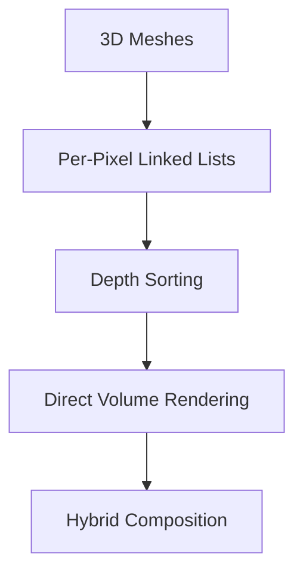

The proposed HybridBrainViz methodology becomes:

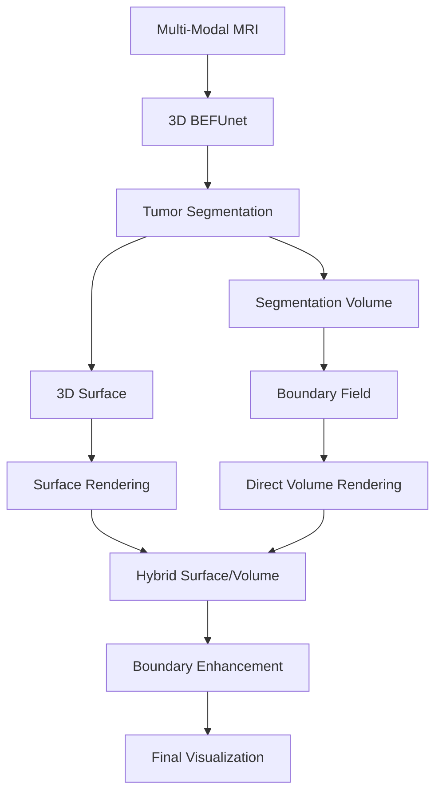

The major difference is therefore not that HybridBrainViz simply reproduces
the reference paper.

It uses the reference paper as the hybrid-rendering foundation while introducing
a segmentation-aware boundary representation specifically designed for brain
tumor visualization.

# 4.1 Surface Rendering Foundation

Repository:

3D-Brain-Tumor-Mesh-Viewer

Current capabilities include:

OBJ loading
mesh representation
vertex normal computation
OpenGL mesh rendering
camera interaction
transparency
multiple tumor compartments

Existing assets include:

whole tumor
whole tumor reference
tumor core
enhancing tumor

The existing viewer therefore provides the foundation for:

ISurfaceService

# 4.2 Volume Rendering Foundation

Repository:

BoundaryEnhancedDVR

Current capabilities include:

NIfTI loading
3D texture upload
proxy-cube rendering
back-face position rendering
front-to-back ray marching
T1ce sampling
FLAIR sampling
segmentation sampling
gradient computation
transfer-function logic
Phong illumination
boundary-dependent opacity/color enhancement
FPS measurement
CNR
SSIM
boundary metrics

The current renderer uses a cube as proxy geometry.

This is correct and should be retained.

The cube does not represent the tumor.

It defines the volume through which the GPU casts rays.

# 5. Proposed Visualization Architecture

The Visualization Subsystem is composed of four principal services.

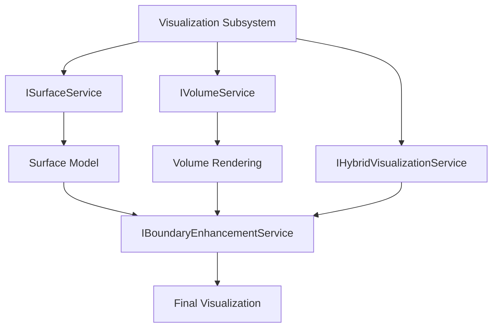

# 6. End-to-End Algorithm

The complete algorithm is:
Algorithm: Boundary-Enhanced Hybrid Brain Tumor Visualization

Input:

T1
T1ce
T2
FLAIR

Output:

Boundary-enhanced 3D brain tumor visualization

Step 1

Load multi-modal MRI.

Step 2

Validate dimensions, spacing, orientation, and registration.

Step 3

Normalize modalities.

Step 4

Run 3D BEFUnet.

Step 5

Generate tumor segmentation.

Step 6

Generate tumor boundary representation.

Step 7

Extract tumor surface.

Step 8

Upload MRI and segmentation volumes to GPU.

Step 9

Generate volume-rendered representation.

Step 10

Render tumor surface.

Step 11

Generate hybrid surface-volume representation.

Step 12

Calculate segmentation-aware boundary strength.

Step 13

Apply adaptive boundary enhancement.

Step 14

Composite enhanced boundary information with hybrid rendering.

Step 15

Display final visualization.

# 7. Algorithm 1: Multi-Modal MRI Preparation

Input

Four MRI modalities:

T1

T1ce

T2

FLAIR

Output

Registered normalized volume set.

Procedure

FOR each modality:

    Load NIfTI

    Read:
        dimensions
        voxel spacing
        origin
        orientation
        affine

    Validate spatial metadata

    Normalize intensity

END FOR

Verify registration

Create MultiModalVolume

Mathematical representation

Let:

$$
\mathcal{M} = \{I_{T1}, I_{T1ce}, I_{T2}, I_{FLAIR}\}
$$

Each modality is represented as:

$$
I_m(x,y,z)
$$

where m represents the modality.

The normalized volume is:

I'_m(x, y, z) = (I_m(x, y, z) - I_min) / (I_max - I_min)

# 8. Algorithm 2: 3D BEFUnet Segmentation

The segmentation stage produces the anatomical label volume used by the
visualization subsystem.

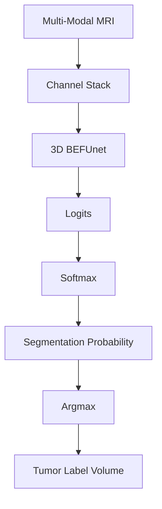
For each voxel, the class probability is:

P(c | x, y, z) = Softmax(Lc)

The predicted class is:

ŷ(x, y, z) = arg max_c P(c | x, y, z)

The resulting segmentation volume is:

S(x, y, z) ∈ {0, 1, ..., C - 1}

For brain tumor visualization, the labels may represent:

- 0 = Background
- 1 = Necrotic / Non-enhancing tumor
- 2 = Edema
- 3 = Enhancing tumor

The exact mapping must follow the selected dataset convention.

# 9. Algorithm 3: 3D Tumor Boundary Extraction

Boundary extraction is a central component of the proposed framework.

The existing prototype contains a 2D boundary computation.

This is insufficient for the final 3D framework.

HybridBrainViz therefore defines a true 3D boundary operator.

For each voxel v, the binary boundary indicator is:

B(v) =
- 1, if any neighboring voxel belongs to a different class
- 0, otherwise
  
$$
B(v) =
\begin{cases}
1: & \text{if any neighboring voxel belongs to a different class} \ 
0: & \text{otherwise}
\end{cases}
$$

Using a 6-connected neighborhood:

$$
N_6(v) =
{v_{x}^+,v_{x}^-,v_{y}^+,v_{y}^-,v_{z}^+,v_{z}^-}
$$

The boundary strength is:

$$
B(v) =
\max_{u \in N_6(v)}
\left|S(v)-S(u)\right|
$$

A distance-based boundary field may then be constructed:

$$
D_B(v) =
\exp
\left(
-\frac{d(v,B)^2}{2\sigma_B^2}
\right)
$$

where:

- d(v, B) is the distance to the nearest boundary voxel
- σ_B controls the boundary thickness

This produces a continuous boundary influence field instead of a binary edge.

# 10. Algorithm 4: Surface Generation

The segmentation volume is converted into a polygonal representation.
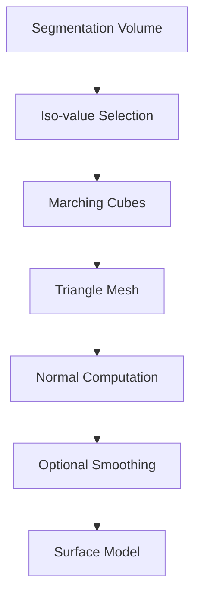
For a binary tumor mask:
$$
S(x,y,z) \in \{0,1\}
$$
the iso-value is typically: 
$$
\tau = 0.5
$$

Marching Cubes evaluates each voxel cube and determines the intersected
triangles using the standard 256-case lookup structure.

The output is:
$$
M = (V,F,N)
$$
where:

V = vertices
F = triangle faces
N = normals

The mesh inherits the spatial geometry of the segmentation volume.

# 11. Algorithm 5: Direct Volume Rendering

The volume renderer uses proxy geometry.

flowchart TD MRI["MRI Volume"] CUBE["Proxy Cube"] MRI --> CUBE

The cube defines the spatial domain of the volume.

It does not represent anatomical geometry.

This is why the cube should remain in HybridBrainViz.

Ray Generation

For every screen pixel:
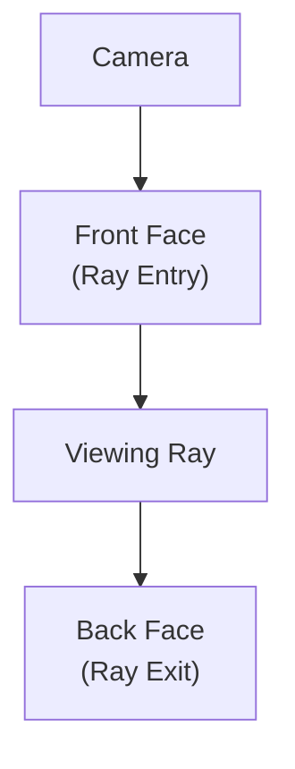
The current implementation stores the back-face texture coordinates and uses
the fragment's front-face texture coordinate as the ray entry point.

The ray is:

$$
r(t) = p_{entry} + td
$$
where:
$$
d = -\frac{p_{exit} - p_{entry}}{||p_{exit} - p_{entry}||}
$$

Sampling

The ray is divided into N equally spaced samples.

$$
p_i = p_{entry} + i \Delta s d
$$

At each sample:

- MRI density
- FLAIR
- Segmentation label
- Gradient
- Boundary strength

are evaluated.

Volume Gradient

The current implementation uses central differences.
For voxel spacing:
$$
h_x, h_y, h_z
$$

$$
G_x = (I(x+h_x,y,z) - I(x-h_x,y,z)) / (2h_x)
$$

$$
G_y = (I(x,y+h_y,z) - I(x,y-h_y,z)) / (2h_y)
$$

$$
G_z = (I(x,y,z+h_z) - I(x,y,z-h_z)) / (2h_z)
$$


The gradient magnitude is:

$$
G = \sqrt{G_x^2 + G_y^2 + G_z^2}
$$

The normalized gradient is then computed as:

$$
G_n = clamp(kG,0,1)
$$


The gradient magnitude is:

$$
G = \sqrt{G_x^2 + G_y^2 + G_z^2}
$$

The normalized gradient is then computed as:

$$
G_n = clamp(kG,0,1)
$$

# 12. Algorithm 6: Surface–Volume Hybrid Rendering

The hybrid renderer combines two complementary representations.

Surface

Provides:

- explicit tumor geometry
- anatomical boundary
- spatial orientation
- semantic structure

Volume

Provides:

- internal MRI information
- intensity variation
- subtle structures
- information missed by segmentation

The reference paper motivates this combination because segmented meshes can
miss clinically relevant information present in the original medical volume.

Hybrid Composition

The conceptual pipeline is:
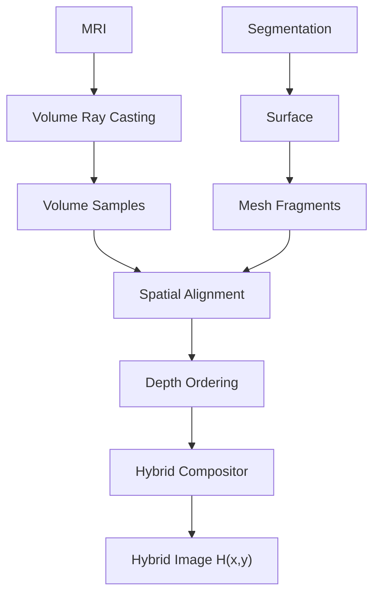

# 13. Algorithm 7: Segmentation-Aware Boundary Enhancement

This is the principal research contribution of HybridBrainViz.

The objective is to enhance boundaries using both:

image-derived information
segmentation-derived information

rather than relying exclusively on raw intensity gradients.

The proposed boundary model therefore combines:

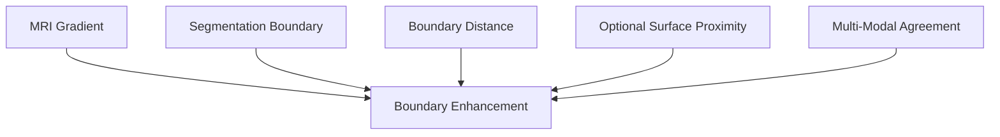

# 13.1 Image Boundary Strength

For each modality:

$$ G_m(x) = ||\nabla I_m(x)|| $$

The gradient magnitude is normalized as:

$$
\tilde{G}_m(x) = (G_m(x) - G_{\min}) / (G_{\max} - G_{\min} + \epsilon)
$$

The multi-modal gradient can be defined as:

$$ G_{multi}(x) = \sum_m w_m \tilde{G}_m(x) $$

$$ \sum_m w_m = 1 $$

where:

- T1       w1
- T1ce     w2
- T2       w3
- FLAIR    w4

The weights become experimental parameters rather than hard-coded assumptions.

# 13.2 Segmentation Boundary Strength

The segmentation boundary is:

$$
B(x) \in [0,1]
$$

where values close to one represent strong class transitions.

13.3 Boundary Distance

The distance field is:

$$ D(x) = exp(- \frac{d(x,B)^2}{2\sigma_B^2} ) $$

This prevents the enhancement from becoming a one-voxel discontinuity.

where $d(x,B)$ is the distance from position $x$ to the segmentation boundary $B$, while $d(x,M)$ is the distance to the surface mesh $M$.

# 13.4 Surface Proximity

If a tumor surface is available, the distance from the volume sample to the
surface may be used:

$$ P_s(x) = exp(- \frac{d(x,M)^2}{2\sigma_s^2}) $$

This provides a bridge between:

- segmentation,
- surface geometry,
- volumetric rendering.

13.5 Multi-Modal Agreement

A modality agreement term may be defined as:

$$ A(x) = (1/M) \sum_{m=1}^{M} 1(\tilde{G}_m(x) > \tau_g) $$

This estimates whether multiple MRI modalities independently support the
presence of a boundary.

where:

- $M$ is the number of MRI modalities.
- $\tilde{G}_m(x)$ is the normalized gradient response of modality $m$.
- $\tau_g$ is the gradient threshold.
- $1(\cdot)$ is an indicator function that returns $1$ when the condition is satisfied and $0$ otherwise.

# 14. Boundary Confidence Model

The combined boundary confidence is computed as:

$$ C_B(x) = \alpha G_{multi}(x) + \beta B(x) + \gamma D(x) + \delta P_s(x) + \eta A(x) $$

subject to:
The weighting coefficients satisfy:

$$
\alpha + \beta + \gamma + \delta + \eta = 1
$$

The weights are experimentally optimized.

For the first implementation, a simplified model should be used:

$$ C_B = \alpha G_{multi} + \beta B + \gamma D $$

This allows the research contribution to be evaluated before introducing
surface-proximity information.

# 15. Adaptive Boundary Enhancement

The enhancement should modify both color and opacity.

The original surface color is represented by:

$$
C_s = (R,G,B)
$$

where $R$, $G$, and $B$ represent the red, green, and blue color components.
and $$ \alpha_s $$ be the original opacity.

The enhanced surface color is computed using boundary confidence:

$$
C'_s = (1-\lambda C_B)C_s + \lambda C_B C_{edge}
$$

where:

- $C_s$ is the original surface color.
- $C_{edge}$ is the boundary-enhancement color.
- $C'_s$ is the resulting enhanced surface color.
- $C_B$ is the boundary confidence.
- $\lambda$ controls the strength of the boundary enhancement.

Opacity becomes:

$$
\alpha'_s = clamp(\alpha_s + \mu C_B, 0, 1)
$$

The enhancement strength is:

$$
E(x) = \lambda C_B(x)
$$

This allows boundary emphasis to vary continuously rather than applying a
uniform outline.

Where:

- $\alpha_s$ is the original surface opacity.
- $\alpha'_s$ is the enhanced surface opacity.
- $\mu$ controls the influence of boundary confidence on opacity.
- $C_B$ is the boundary confidence.
- clamp(..., 0, 1) restricts the opacity to the valid range $[0,1]$.
- $E(x)$ is the boundary enhancement strength at position $x$.
- $\lambda$ controls the overall strength of boundary enhancement.

# 16. Boundary Enhancement Algorithm

Algorithm: BoundaryEnhancedSample()

Input:
    MRI modalities
    segmentation label
    surface information
    transfer function

Output:
    enhanced sample color
    enhanced sample opacity

1. Sample MRI modalities.

2. Compute modality gradients.

3. Compute multi-modal gradient strength.

4. Read segmentation label.

5. Determine whether voxel belongs to a segmentation boundary.

6. Compute distance to segmentation boundary.

7. If available, compute distance to tumor surface.

8. Compute multi-modal boundary agreement.

9. Combine the boundary terms.

10. Clamp boundary confidence.

11. Apply adaptive color enhancement.

12. Apply adaptive opacity enhancement.

13. Return enhanced sample.

# 17. Boundary-Enhanced Hybrid Composition

The final hybrid algorithm is:

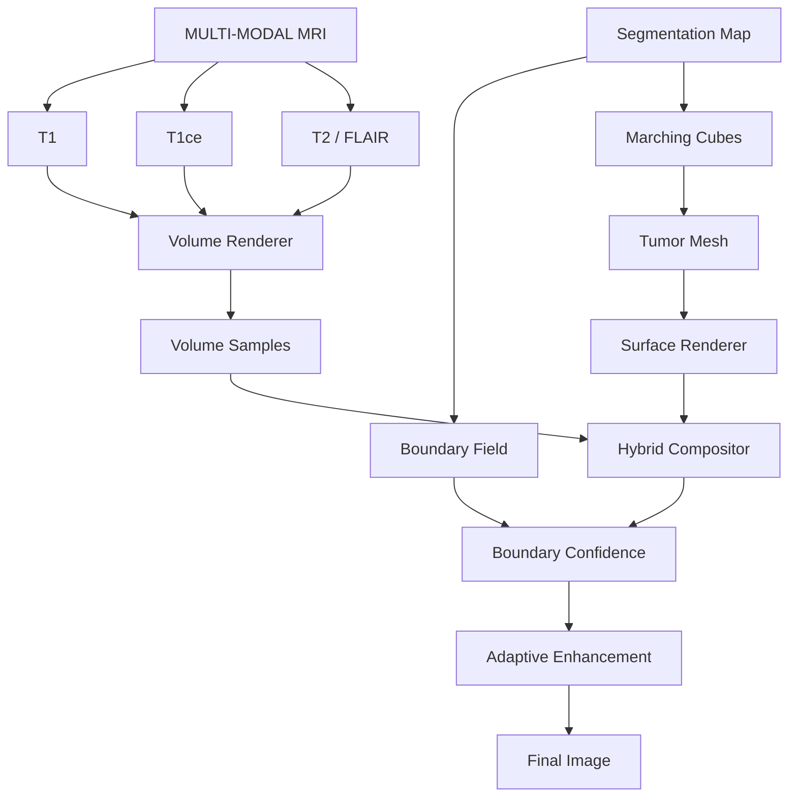
# 18. Render Graph Representation

The Render Graph becomes:

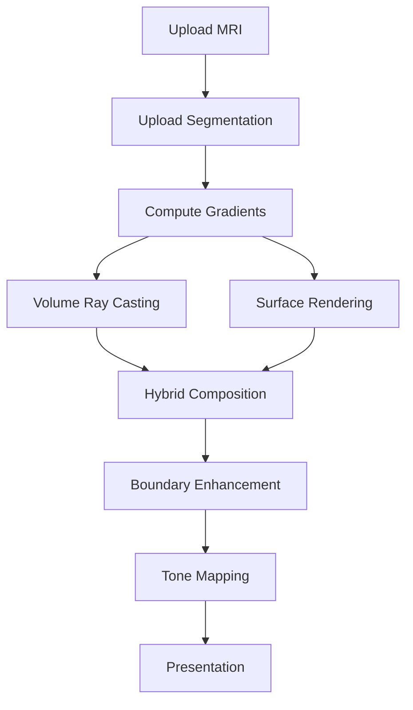

The important architectural property is that boundary enhancement is an
independent render pass.

Therefore, HybridCompositionPass does not contain the boundary-enhancement algorithm. Instead, BoundaryEnhancementPass consumes the hybrid result and boundary resources.

This permits alternative boundary algorithms to be compared without modifying
the hybrid renderer.

# 19. Complete Processing Flow

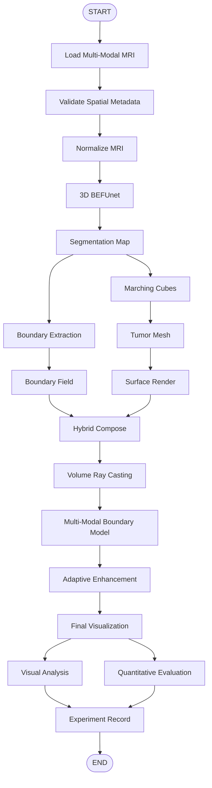

# 20. GPU Processing Flow

The GPU implementation is organized into rendering passes.

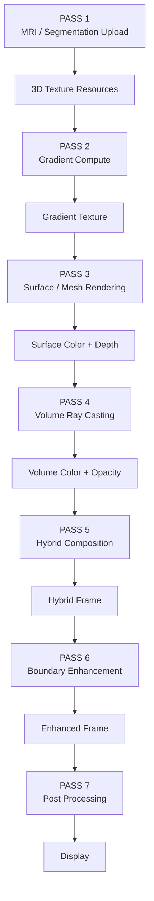

# 21. Implementation Mapping

The existing implementation maps to the proposed architecture as follows.

| Existing Code Target | HybridBrainViz Component       |
| -------------------- | ------------------------------ |
| `NiftiLoader`        | `ImagingSubsystem`             |
| `VolumeLoader`       | `ImagingSubsystem`             |
| `VolumeTexture`      | `RHI / VolumeService`          |
| `MeshExtraction`     | `Segmentation/Surface Service` |
| `MeshRenderer`       | `SurfaceService`               |
| `GradientVolume`     | `BoundaryEnhancementService`   |
| `TransferFunction`   | `VolumeService`                |
| `VolumeRenderer`     | `VolumeService`                |
| `Evaluation`         | `EvaluationSubsystem`          |
| `Camera`             | `SceneSubsystem`               |
| `Shader`             | `RHI`                          |
| `Boundary.comp`      | `BoundaryEnhancementPass`      |
| `Gradient.comp`      | `GradientComputePass`          |

# 22. Important Existing-Code Findings

The current repositories provide strong foundations but are prototypes rather
than the final architecture.

Finding 1: Existing DVR uses proxy geometry

The current renderer uses a cube with texture coordinates.

This should remain.

The cube is the proxy geometry used to establish the ray entry and exit
positions.

Finding 2: Existing boundary computation is not yet fully 3D

The current CPU implementation: computeBoundary(mask,width,height) operates on a 2D array. The final implementation must operate on: width × height × depth and respect voxel spacing.

Finding 3: Existing shader boundary enhancement is intensity-based

The current shader computes:

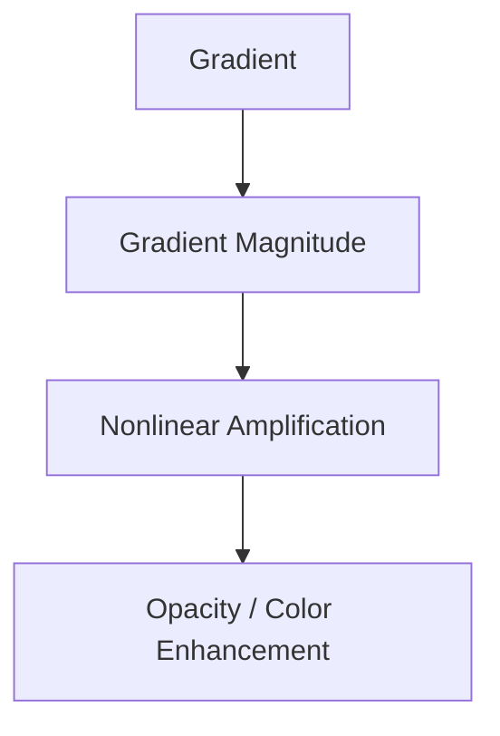
This is a useful baseline.

However, it does not yet represent the full proposed
segmentation-aware boundary model.

Therefore the existing method should become:
Baseline:
Gradient-Based Boundary Enhancement

while the proposed method becomes:

Proposed:
Segmentation-Aware Multi-Modal Boundary Enhancement

This distinction is extremely important for your experiments.

# 23. Baseline Methods

The evaluation should compare at least the following configurations.

Baseline A

Surface only.
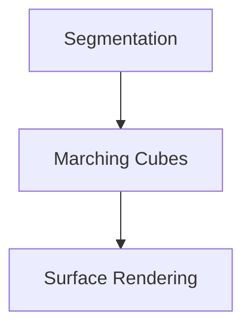
Baseline B

DVR only.
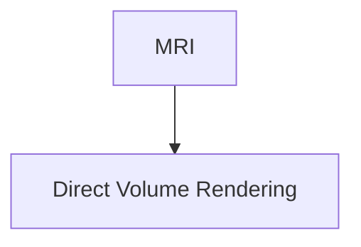
Baseline C

Hybrid without boundary enhancement.
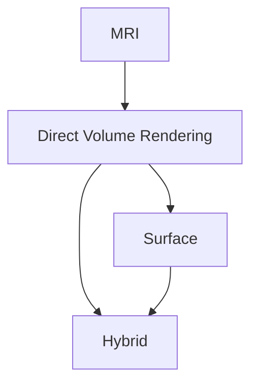
Baseline D

Hybrid + intensity-gradient enhancement.

This corresponds closely to the current prototype.
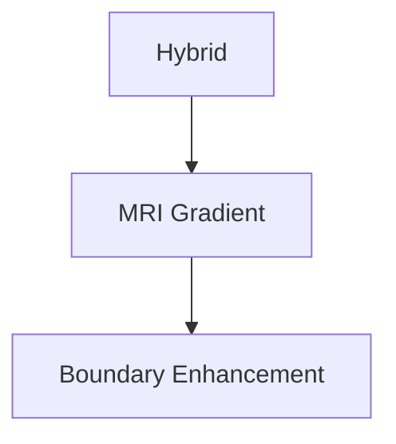
Proposed Method

Hybrid + segmentation-aware multi-modal boundary enhancement.
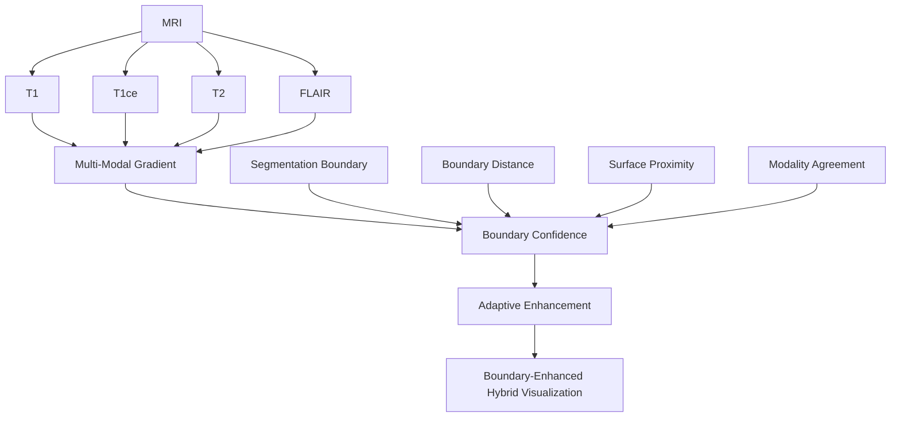
This baseline progression is essential because it allows the contribution to
be attributed scientifically.

# 24. Ablation Study

The proposed boundary model should be evaluated through ablation.

Experiment 1

Remove segmentation boundary.

Variant 1: Multi-Modal Gradient Only
$$
C_B
 = G_{multi}
$$

Experiment 2

Use segmentation boundary only.

Variant 2: Segmentation Boundary Only
$$
C_B = B
$$

Experiment 3

Combine gradient + segmentation boundary.

Variant 3: Gradient and Boundary
$$
C_B = \alpha G_{multi} + \beta B
$$

Experiment 4

Add distance field.

Variant 4: Gradient, Boundary, and Distance
$$
C_B = \alpha G_{multi} + \beta B + \gamma D
$$

Experiment 5

Add surface proximity.

Variant 5: Gradient, Boundary, Distance, and Surface Proximity
$$
C_B = \alpha G_{multi} + \beta B + \gamma D + \delta P_s
$$

Experiment 6

Full proposed method.

Variant 6: Full Boundary Confidence Model
$$
C_B = \alpha G_{multi} + \beta B + \gamma D + \delta P_s + \eta A
$$

where:

$G_{multi}$ — multi-modal gradient response.
$B$ — segmentation boundary response.
$D$ — boundary distance field.
$P_s$ — surface proximity field.
$A$ — multi-modal agreement.
$\alpha,\beta,\gamma,\delta,\eta$ — weighting coefficients.

These variants form a progressive ablation sequence, allowing the contribution of each boundary-enhancement component to be evaluated independently and cumulatively.

This experiment is particularly important for the thesis because it demonstrates
which components actually contribute to boundary visibility.

27. Expected Research Outputs

The system should generate:

Visualization Outputs
surface-only rendering
DVR-only rendering
hybrid rendering
boundary-enhanced rendering
boundary heat maps
gradient maps
segmentation overlays
Quantitative Outputs
Dice
Hausdorff Distance
Boundary Dice
Boundary Precision
Boundary Recall
Boundary F1
CNR
SSIM
FPS
frame time
GPU memory
Research Artifacts

Each experiment should store:

Experiment ID
Dataset ID
Patient/Case ID
Model Version
Segmentation Version
Boundary Algorithm
Boundary Parameters
Transfer Function
Rendering Configuration
Graphics Backend
GPU
Resolution
Metrics
Timestamp

# 28. Limitations

The proposed methodology has several limitations.

Segmentation dependency

Boundary enhancement depends on segmentation quality.

Incorrect segmentation can generate incorrect boundaries.

Therefore segmentation quality must be evaluated independently.

Registration dependency

Misregistration between modalities can produce false boundary evidence.

Spatial metadata must therefore be validated before visualization.

GPU memory

High-resolution 3D textures require substantial GPU memory.

This is particularly important when storing:

T1
T1ce
T2
FLAIR
segmentation
gradient
boundary
intermediate render targets
Depth complexity

If the full per-pixel linked-list OIT approach from the reference paper is
implemented, node-buffer memory becomes dependent on scene depth complexity.

The reference paper explicitly identifies possible node-buffer overflow in
highly complex scenes as a limitation.

# 29. Future Extensions

Future versions may introduce:

Vulkan backend
DirectX 12 backend
GPU compute boundary extraction
adaptive ray marching
multi-dimensional transfer functions
learned boundary enhancement
uncertainty-aware visualization
radiogenomic overlays
temporal tumor visualization
longitudinal comparison
VR/AR interaction
multimodal registration
clinician-centered usability evaluation
# 30. Final Algorithmic Architecture

The final HybridBrainViz visualization framework is summarized as:

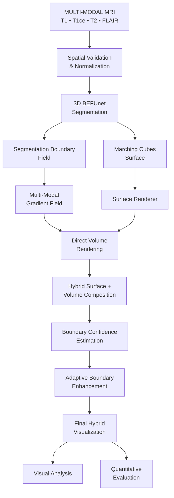

# 31. Research Contribution Boundary

The contribution of HybridBrainViz should therefore be explicitly separated
into three levels.

Contribution 1 — Integration

Integration of:

multi-modal MRI,
AI segmentation,
surface rendering,
DVR.
Contribution 2 — Hybrid Visualization

A unified surface-volume visualization framework adapted to brain tumor MRI.

Contribution 3 — Boundary Enhancement

A segmentation-aware, multi-modal adaptive boundary-enhancement mechanism
designed to improve the visibility and interpretability of tumor boundaries.

The third contribution is the primary novel visualization contribution.

The first two establish the visualization foundation required to evaluate it.

Architectural Summary

HybridBrainViz transforms multi-modal brain MRI and AI-generated tumor
segmentation into a unified hybrid visualization consisting of volumetric,
surface, and boundary representations.

The framework preserves the complementary advantages of surface and volume
rendering while introducing a segmentation-aware boundary field that combines
MRI gradients, segmentation transitions, spatial distance, surface proximity,
and multi-modal evidence.

The proposed architecture therefore evolves from: 31. Research Contribution Boundary

The contribution of HybridBrainViz should therefore be explicitly separated
into three levels.

Contribution 1 — Integration

Integration of:

multi-modal MRI,
AI segmentation,
surface rendering,
DVR.
Contribution 2 — Hybrid Visualization

A unified surface-volume visualization framework adapted to brain tumor MRI.

Contribution 3 — Boundary Enhancement

A segmentation-aware, multi-modal adaptive boundary-enhancement mechanism
designed to improve the visibility and interpretability of tumor boundaries.

The third contribution is the primary novel visualization contribution.

The first two establish the visualization foundation required to evaluate it.

Architectural Summary

HybridBrainViz transforms multi-modal brain MRI and AI-generated tumor
segmentation into a unified hybrid visualization consisting of volumetric,
surface, and boundary representations.

The framework preserves the complementary advantages of surface and volume
rendering while introducing a segmentation-aware boundary field that combines
MRI gradients, segmentation transitions, spatial distance, surface proximity,
and multi-modal evidence.

The proposed architecture therefore evolves from: Surface Rendering and Direct Volume Rendering to Segmentation-Aware Boundary-Enhanced Hybrid Visualization.

The resulting framework provides both a software-engineering architecture and
a reproducible algorithmic methodology for investigating whether explicit,
adaptive boundary enhancement improves the visual interpretation of
multi-modal brain tumor structures without imposing unacceptable rendering
cost.

## The Most Important Finding from the Existing Code

There is a **useful research story hidden in the existing implementation**.

The current `BoundaryEnhancedDVR` already implements a compact boundary-aware direct volume rendering pipeline:

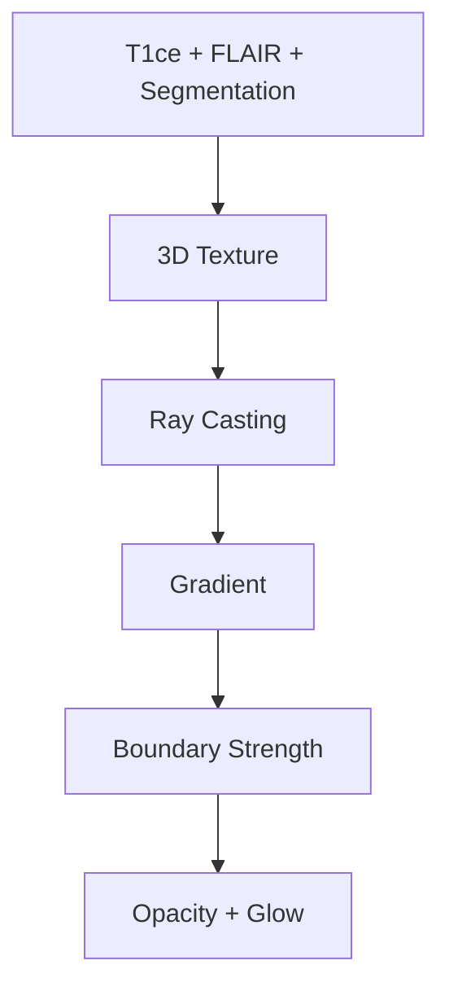

The implementation can therefore be interpreted as a sequence of transformations:

```text
Multi-Modal MRI + Segmentation
            |
            v
        3D Texture
            |
            v
       Volume Ray Casting
            |
            v
      Gradient Estimation
            |
            v
      Boundary Strength
            |
            v
   Opacity + Boundary Glow
```

This provides the foundation for extending the existing renderer into the proposed **Boundary-Enhanced Hybrid Visualization Framework**, where gradient-derived boundary information can be combined with segmentation boundaries, boundary distance, surface proximity, and multi-modal agreement.

Your shader currently computes a 3D intensity gradient, nonlinearly amplifies it, adds it to opacity, and then applies additional color/glow enhancement. That gives us an excellent Baseline-D: Gradient-Based Boundary Enhancement.

But the proposed research algorithm becomes:

## The Most Important Finding from the Existing Code

There is a **useful research story hidden in the existing implementation**.

The current `BoundaryEnhancedDVR` already implements a compact boundary-aware direct volume rendering pipeline:

```mermaid
flowchart TD
    INPUT["T1ce + FLAIR + Segmentation"]
    TEX["3D Texture"]
    RC["Ray Casting"]
    GRAD["Gradient"]
    BS["Boundary Strength"]
    ENH["Opacity + Glow"]

    INPUT --> TEX
    TEX --> RC
    RC --> GRAD
    GRAD --> BS
    BS --> ENH
```

The implementation can therefore be interpreted as a sequence of transformations:

```text
Multi-Modal MRI + Segmentation
            |
            v
        3D Texture
            |
            v
       Volume Ray Casting
            |
            v
      Gradient Estimation
            |
            v
      Boundary Strength
            |
            v
   Opacity + Boundary Glow
```

This provides the foundation for extending the existing renderer into the proposed **Boundary-Enhanced Hybrid Visualization Framework**, where gradient-derived boundary information can be combined with segmentation boundaries, boundary distance, surface proximity, and multi-modal agreement.
That is a much stronger research contribution than simply saying "we enhanced the boundary using gradients."

One more critical distinction: don't claim to have implemented the paper yet

The paper's hybrid renderer uses:

```mermaid id="n7x4pz"
flowchart TD
    MF["Mesh Fragments"]
    HP["Head Pointer Buffer"]
    NB["Node Buffer"]
    PPLL["Per-Pixel Linked List"]
    DS["Depth Sorting"]
    DVR["Direct Volume Rendering"]
    HR["Hybrid Result"]

    MF --> HP
    HP --> NB
    NB --> PPLL
    PPLL --> DS
    DS --> DVR
    DVR --> HR
```
Specifically, its node structure stores color, depth, world position and a pointer to the next node, while a head buffer stores the first node for each screen pixel.

Your current DVR instead uses:

```mermaid id="v7m3qx"
flowchart TD
    CUBE["Proxy Cube"]
    BFT["Backface Texture"]
    RAY["Front-to-Back Ray"]
    SAMPLE["Volume Sampling"]
    ACC["Alpha Accumulation"]

    CUBE --> BFT
    BFT --> RAY
    RAY --> SAMPLE
    SAMPLE --> ACC
```
The paper also uses a cube/bounding volume for the DVR stage, so your cube-based volume renderer is absolutely valid. The paper explicitly describes rendering the final shader over a cubic mesh whose volume is defined by the bounding box of the segmented model and medical image volume.

So our implementation strategy should be:

Phase A — Reuse what you already have

```mermaid id="q7m3xz"
flowchart TD
    MV["Mesh Viewer"]
    DVR["Direct Volume Renderer"]
    BEF["3D BEFUnet"]

    FOUNDATION["HybridBrainViz Foundation"]

    MV --> FOUNDATION
    DVR --> FOUNDATION
    BEF --> FOUNDATION
```
Phase B — Implement true 3D boundary representation

```mermaid id="z3k7mp"
flowchart TD
    SEG["Segmentation"]
    BOUND["3D Boundary"]
    DIST["Distance Field"]

    SEG --> BOUND
    BOUND --> DIST
```
Phase C — Implement hybrid compositing

```mermaid id="x8k2mz"
flowchart TD
    SURFACE["Surface"]
    DVR["Direct Volume Rendering"]
    HYBRID["Hybrid"]

    SURFACE --> HYBRID
    DVR --> HYBRID
```
Phase D — Implement your contribution
```mermaid
flowchart TD
    HYBRID["Hybrid"]
    GRAD["Multi-Modal Gradient"]
    BOUND["Segmentation Boundary"]
    DIST["Distance Field"]
    PROX["Surface Proximity"]

    BC["Boundary Confidence"]
    AE["Adaptive Enhancement"]

    HYBRID --> BC
    GRAD --> BC
    BOUND --> BC
    DIST --> BC
    PROX --> BC

    BC --> AE
```
Phase E — Implement the paper's advanced OIT mechanism

Only after the simpler hybrid renderer is working, we can implement:

```mermaid
flowchart TD
    PPLL["Per-Pixel Linked List"]
    DS["Depth Sorting"]
    DVR["Direct Volume Rendering"]

    PPLL --> DS
    DS --> DVR
```
This is important because otherwise we risk spending weeks implementing OIT before we have a working scientific baseline.